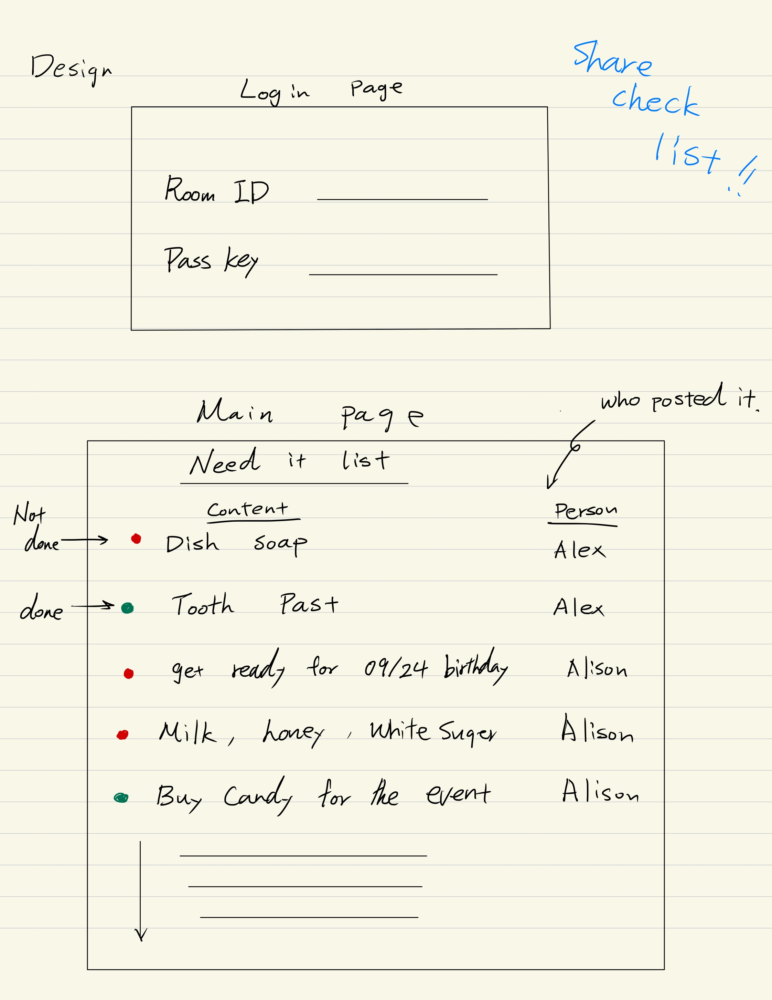

# Need it List

## Startup Specification

### Elevator Pitch
What do you use to communicate essential information within your family? Perhaps you use messaging apps or sticky notes. The app I'm developing will help make this process more reliable and easier for everyone. With this app, everyone who shares an ID and password can access the list and update it with the necessary tasks. Completed tasks will be marked as green, while incomplete tasks will appear in red, allowing you to see what needs attention at a glance. This app will help eliminate forgotten communications or tasks within your group.

## Design

## Key Features
- Secure login with shared ID and password
- Ability to add, update, and remove tasks on the list
- Real-time display of completed (green) and incomplete (red) tasks
- Accessible by all users who share the login credentials
- Task status updated and synchronized in real-time across all users
- Simple, easy-to-use interface for family or group communication
- Admin privileges to manage access and list settings

## Technologies
I am going to use the required technologies in the following ways:

- **HTML**: Uses correct HTML structure for the application. Two main HTML pages: one for login and one for the task management dashboard.
- **CSS**: Styling to ensure the app is responsive and looks clean on various devices, with appropriate whitespace, color contrasts (green for completed tasks, red for incomplete tasks), and easy readability.
- **React**: Provides the user interface, handling login, displaying, and updating tasks.
- **Service**: Backend service with endpoints for:
  - Secure login
  - Retrieving and updating task lists
  - Task status management (complete/incomplete)
- **Database/Login**: Stores user information, shared tasks, and task statuses. Provides secure storage of credentials and task data. Only authenticated users can access and update the list.
- **WebSocket**: Synchronizes task updates in real-time across all users, ensuring that changes made by one user are immediately visible to others.